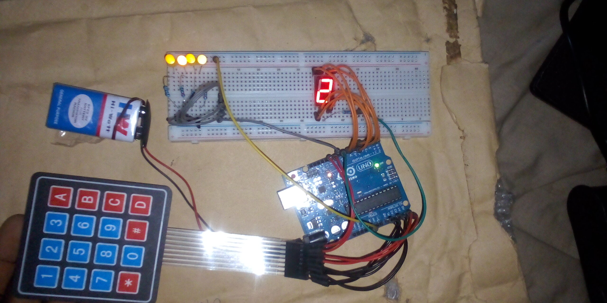

# Keypad LED Controlled System - ARDUINO PROJECT

## Overview
This project demonstrates a keypad-controlled LED and 7-segment display system using Arduino. A 4×4 matrix keypad is used to input numbers (0–9), which are then displayed on a 7-segment LED display while simultaneously controlling the brightness of an LED using PWM.

## Objective
- Learn how to interface a 4×4 matrix keypad with Arduino  
- Display numeric input on a 7-segment LED display  
- Control LED brightness using PWM (`analogWrite`)  
- Map keypad inputs to multiple output actions  
- Strengthen understanding of input–output integration  

## Components Used
- Arduino Uno  
- 4×4 Matrix Keypad  
- 1-Digit 7-Segment Display  
- LED (brightness-controlled)  
- 220Ω resistors  
- Breadboard  
- Jumper wires  
- 9V Battery  
- 9V Battery Clip to DC Barrel Jack  

## Circuit Diagram

[Click Here For other Images](images/)

## How It Works
1. The 4×4 keypad is connected to the Arduino using row and column pins.  
2. When a key (0–9) is pressed, the Arduino detects the key value using the `Keypad` library.  
3. The pressed number is displayed on the 7-segment display by activating the appropriate segments.  
4. At the same time, the numeric value controls the brightness of an LED:
   - Lower numbers correspond to lower brightness  
   - Higher numbers increase brightness up to full intensity  
5. PWM (`analogWrite`) is used to smoothly adjust LED brightness.  
6. The Serial Monitor logs the pressed key value for debugging and monitoring.  

## Code
The Arduino sketch for this project is located in the [code/ directory](code/keypad_led_controlled_project_on_6th_november_2025.ino).

## Demo Video
A demonstration video showing the working project is included in this repository.

📹 **Project Demonstration:**  
[Click here to watch/download the demo video](video/)

*(If the video does not preview directly on GitHub, please download it using the link above.)*

## Reflection (What I Learned)
- Interfacing and scanning a matrix keypad  
- Driving a 7-segment display using digital outputs  
- Controlling LED brightness with PWM  
- Mapping single inputs to multiple outputs  

## Challenges Faced
- Correctly mapping keypad key codes to numbers  
- Coordinating 7-segment display logic with brightness control  
- Managing multiple output devices simultaneously  

## Possible Improvements
- Add support for alphabetic keypad keys (A–D, *, #)  
- Display brightness level on an LCD  
- Implement key debounce logic  
- Expand to multi-digit 7-segment displays  

## Project Status
Completed
